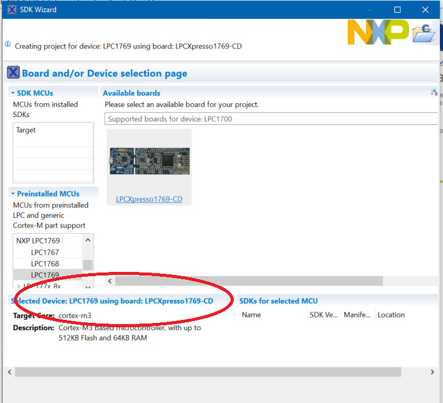
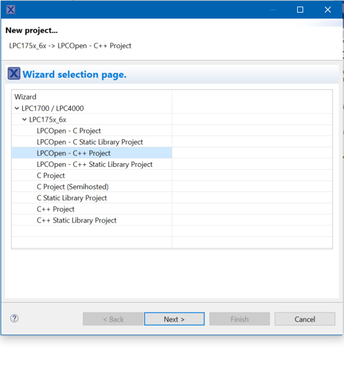
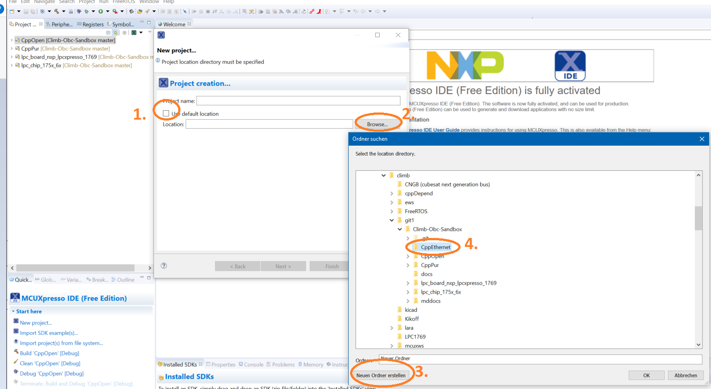
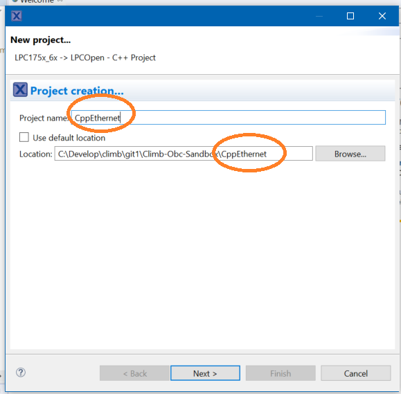

:warning: Its very important here to 'untick' the 'use Default location'! Choose a **newly created directory** beneath your git root directory. Use the **planned projectName** as directory name!!! :warning:

Now you should name your project same as the created subfolder!

