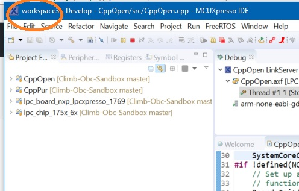
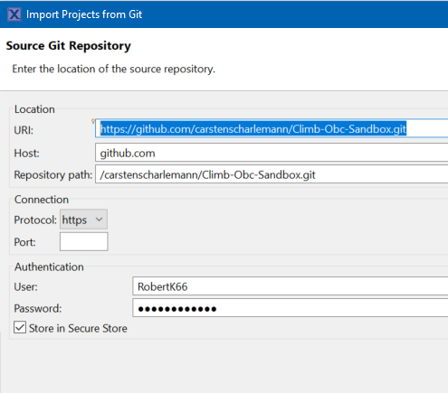
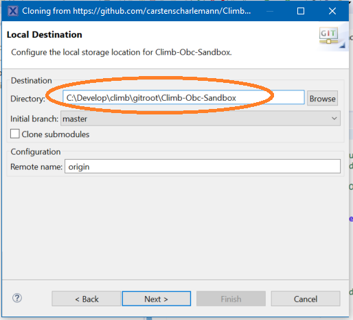

We start out development with this IDE version: **MCUXpresso IDE v10.1.1 [Build 606] [2018-01-02]**
This is the "full-featured free (code size unlimited)" version of the current NXP-IDE

You can get its binaries (Win/Linux/Apple included) either from
- the NXP website (register required): [NXP - Website download](https://www.nxp.com/support/developer-resources/software-development-tools/mcuxpresso-software-and-tools/mcuxpresso-integrated-development-environment-ide:MCUXpresso-IDE?&tid=vanMCUXPRESSO/IDE)
- or from our common project drive, hosted by FHWN under the path: climb/7 RKOS/tools/MCUXpressoIDE.7z

## Install the IDE

1.  Unzip the MCUXpressoIDE.7z and use the version you need. 
    - for windows there is the Installer: MCUXpressoIDE_10.1.1_606.exe.
    - for linux the mcuxpressoide-10.1.1_606.x86_64.deb.bin is a self containing installer shell script....
    
2. Apply the provided patch LPC804patch_MCUXpressoIDE_v10p1p1.zip
    - unzip and
    - follow instructions in readme.txt

## Setup new/empty workspace and import project structure from github

1. Workspaces

The MCUXpresso IDE is based on Eclipse. Eclipsa always starts up with your last used 'Workspace'. When started the first time there is a default worspace generated in your user profile. You can see the current used workspace in the upper left corner of the IDE.

2. Generate a new workspace with

- File - Switch Workspace - Other...
- and choose a empty directory somewhere on your disk

3. Import projects from github repository

- File - Import
- select the "projects from git" Import Wizzard under the git folder
- choose "Clone URI" as repository source
- Fill in following data in the upcoming Dialog: 
  - URI: "https://github.com/carstenscharlemann/Climb-Obc-Sandbox.git"
  - Username Password of yout github account

- On the next page choose the branches you want to clone locally (master, develop, ....)
- Next page: **choose a destination folder OUTSIDE OF YOUR Eclips workspace folder!!!**

- Now select 'Import existing Eclipse Projects'
- Select (tick) all projects to import in your workspace
- Click 'Finish' Button to get all projects into your workspace.

  
   

